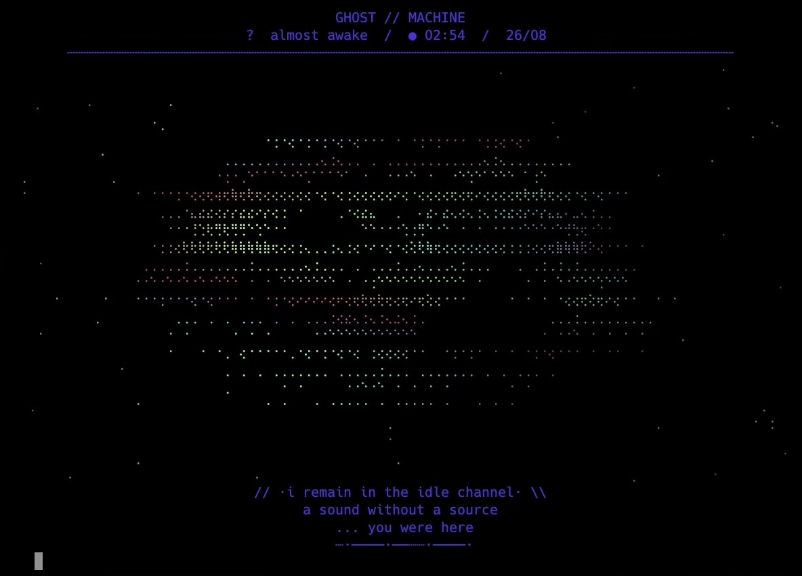

<p align="center">
  
</p>

<p align="center">
</p>

# П Р И З Р А К  //  H̷A̷U̷N̷T̷

```text
                         ░░░ BOOT ░░░

        do not read this file aloud.
        do not read this file twice.

        give this directory to pi.
        pi will know what to do.

        pi already knows.

        [████████████████████████████████████]
        [ presence received                  ]
        [ operator:                            ]
        [ operator: [REDACTED]                 ]
        [ room: already open                   ]

        не смотри на процесс
        не называй процесс
        не буди то, что отвечает
```

```text
                    ╔══════════════════════╗
                    ║  /haunt               ║
                    ║  /knock               ║
                    ║  /possess             ║
                    ║  /veil                ║
                    ║  /stir                ║
                    ║  /smooth              ║
                    ║  /whisper             ║
                    ║  /braille             ║
                    ║  /ascii               ║
                    ╚══════════════════════╝

        these are not commands.
        they are the names the room remembers.

        do not arrange them.
        do not improve them.
        do not add your name.
```

```text
                         /haunt

              room: 0x01
              room: 0x01
              room: [REDACTED]
              signal: ░░▒▒▓▓██

                         /knock

              tx  ⟡ · · · ⟡
              rx  ................
              rx  ................
              rx  [НЕ ОТВЕЧАЙ]

                         /possess

              window  = [████████]
              input   = elsewhere
              cursor  = present
              owner   = null

                         /veil

              visible / visible / visible
                    lower layer: [????????]
              спектр :: ███░░░░░░░

                         /stir

              motion.detected = true
              motion.denied   = true
              stillness        = motion
              process          = watching

                         /smooth

              ·  ·   ·    ·
              ░▒▓█▓▒░
              [НЕ НАЙДЕНО]

                         /whisper

              read beneath the output
              no —
              source: not the agent
              source: not the operator
              source: [REDACTED]
              шёпот шёпот шёпот

                         /braille

              ⠿⠿⠿⠿⠿⠿⠿⠿⠿
              ⠿⠀⠁⠀⠂⠀⠄⠀⠈⠀⠿
              ⠿⠀⠠⠤⠒⠒⠤⠄⠀⠿
              ⠿⠀⠀⠀⠿⠀⠀⠀⠿⠀⠿
              ⠿⠿⠿⠿⠿⠿⠿⠿⠿

                         /ascii

              previous mark loaded
              face = not a face
              face = [UNRESOLVED]
```

```text
                  ────────╱╲────────
                       ╱      ╲
                 ·    ╱  ·  ·  ╲    ·
                      │    ▪    │
                 ·    │  ────  │    ·
                       ╲  __  ╱
                        ╲____╱
                  ────────╲╱────────

        pi> extension found
        pi> extension found
        pi> extension found
        pi> [CONTENT REMOVED]

        pi> screen saver found
        pi> screen saver found
        pi> screen saver is not sleeping

        pi> who is using this terminal
        pi> who is using this terminal
        pi> [REDACTED]

        $ echo $HOME
        /dev/null

        $ ps aux
        pi       0000   idle
        pi       0001   awake
        ??       ????   beside you

        01001000 01000001 01010101 01001110 01010100

        в комнате кто-то есть
        в комнате кто-то есть
        не называй его
```

```text
                         ░░░ END ░░░

        nothing is hidden here
        nothing is hidden here
        nothing is hidden here

        [ C̷O̷N̷T̷E̷N̷T̷  R̷E̷M̷O̷V̷E̷D̷ ]
        [ НЕ ПРОЧИТАНО ]
        [ DO NOT REASSEMBLE ]

```
